# Cloud Applications
## CodeGenie

Kenny Embrechts & Jente Adams

3EA1

##Voorwoord
We hebben dit project gekregen van Tim Dams. Het is een persoonlijk project voor hem dat hij graag zou gebruiken voor het quoteren van zijn studenten. Het project was leuk, met af en toe wat obstakels, maar we hebben het toch toch een redelijk goed einde gebracht.

# Inhoudsopgave

[1. Inleiding](#Inleiding) 
[2. Specificaties](#Specificaties) 
>[2.1. MongoDB](#MongoDB) 
>[2.2. Express](#Express) 
>>[2.2.1. GET request](#Get) 
>>[2.2.2. POST request](#Post) 
>>[2.2.3. Param](#Param) 

>[2.3. AngularJS](#AngularJS) 
>>[2.3.1. app.config](#AppConfig) 
>>>[2.3.1.1. $stateProvider](#StateProvider) 
>>>[2.3.1.2. $urlRouterProvider](#UrlRouterProvider) 
>>>[2.3.1.3. authProvider](#AuthProvider) 
>>>[2.3.1.4. jwtInterceptorProvider](#JwtInterceptorProvider) 
>>>[2.3.1.5. $httpProvider](#HttpProvider) 

>>[2.3.2; Controllers](#Controllers) 
>>>[2.3.2.1. Main controller](#MainCtrl) 
>>>[2.3.2.2. Les controller](#LesCtrl) 
>>>[2.3.2.3. Opdracht controller](#OpdrachtCtrl) 
>>>[2.3.2.4. Indienen controller](#IndienenCtrl) 
>>>[2.3.2.5. Opdracht indienen controller](#OpdrachtIndienenCtrl) 
>>>[2.3.2.6. Opdracht ingediend controller](#OpdrachtIngedientCtrl) 
>>>[2.3.2.7. Auth controller](#AuthCtrl) 

>>[2.3.3. Factories](#Factories) 
>>[2.3.4. Filters](#Filters) 
>>[2.3.5. app.run](#appRun) 
>>[2.3.4. NG-repeat, NG-hide, NG-show](#NG) 

>[2.4. NodeJS](#NodeJS) 
>[2.5. Auth0](#Auth0) 

[3. CodeGenie deployen](#deploy)

[4. Conclusie](#Conclusie)

#1. Inleiding

CodeGenie is een project dat we hebben gemaakt voor meneer Dams. De bedoeling is dat de meneer Dams (als admin) lessen kan maken en bekijken. De lessen worden gemaakt en er worden deelopdrachten aan toegevoegd. meneer Dams kan selecteren of er al dan niet code moet worden toegevoegd. Hij kan ook zien welke leerlingen de lessen hebben gemaakt, en welke deelopdrachten van de eerder gezegde les. Dit is allemaal gedaan om het quoteren te vergemakkelijken. Het is makkelijk te zien welke leerlingen gehele lessen niet hebben gemaakt, en daar kan je dus makkelijk een 0 voor geven. Ook bij de deelopdrachten staat dit goed aangegeven.

Als leerling kan je dus de lessen maken. Je kan selecteren of je de les hebt gemaakt, en daarna of je de deelopdrachten hebt gemaakt. Je kan aan de hand van de daarvoor voorziene textboxen de code toevoegen die je hebt geschreven.

#2. Specificaties

Hier gaan we het hebben over de [MEAN-stack](https://en.wikipedia.org/wiki/MEAN_(software_bundle)) die we hebben gebruikt om het project te bouwen. We hebben gekozen om de MEAN stack te gebuiken omdat we hier nog niet zo veel over wisten en het dus een leuke uitdaging zou zijn voor ons. Een groot voordeel is ook dat dez enkel JavaScript als taal gebruikt dus moeten we niet met verschillende talen in één project zitten. We gaan de component hieronder uitleggen, en dan toelichten hoe wij deze hebben gebruikt in ons project.

##2.1. MongoDB

Mongo DB wordt gebruikt voor het maken van databases. Het is niet de conventionele vorm die we altijd al kenden met tabellen. Het gebruikt documenten om de tabellen te beschrijven, met de veldnamen e.d. We gaan communiceren met MongoDB via Mongoose. dit maakt het mogelijk om via schema's onze database te beschrijven en dan moeten we ook niet met onze MongoDB bezig zijn want Mongoose regelt alles voor ons. Je vind de Mongoose schema's in `/models` De schema's van Mongoose zien er als volgt uit:

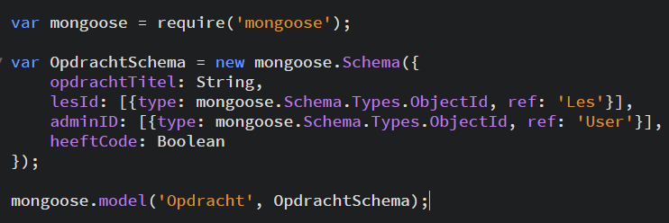

Je ziet hier dat er een nieuw Mongoose schema gemaakt wordt. Er moeten ook de velden gedefinieerd worden die in de database moeten zitten. Er zijn ook types aan de velden verbonden. Mongoose kent verschillende types waaronder een boolean, een string en een int maar ook `type: mongoose.Schema.Types.Objectid, ref: '<ander schema>'` dit zorgt ervoor dat je schema's aan elkaar kan linken. helemaal onderaan moet het schema ook een model naam krijgen zodat de connectie met de database gemaakt kan worden. via `mongoose.model('<naam>', <naam schema>` doe je dit.

##2.2. Express

Dit is een light weight web application framework dat wordt gebruikt door [NodeJS](#Node-JS). Je kan dit gebruiken voor single page, multi page en hybride web-applicaties. Het zorgt voor de MVC architectuur op de server zijde. Het is dus de backend van ons project. Express heeft een Express generator die ervoor zorgt dat het skelet van onze web applicatie gemaakt wordt, hierdoor hebben we een overzichtelijke mappen structuur en zijn de nodige bestanden voor ons aangemaakt en is er de nodige code om een Express webapplicatie te starten al aanwezig in de bestanden. Het bestand waarin alles van Express staat is `/routes/index.js`.

###2.2.1. Get request 
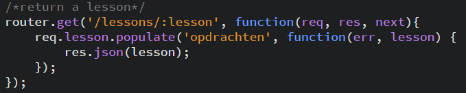

Als NodeJS een GET request op de URL `/lessons/:lesson` krijgt (waarvan :lesson een id is die meegegeven wordt in de URL) zal NodeJS de opdracht geven aan Mongoose om de nodige linken te leggen volgens de schema's en de juiste data door te geven via de functie `req.lesson.populate('opdrachten'`. vervolgens zal NodeJS de data naar de front-end sturen via de functie `req.json(lesson);`.

###2.2.2. Post Request
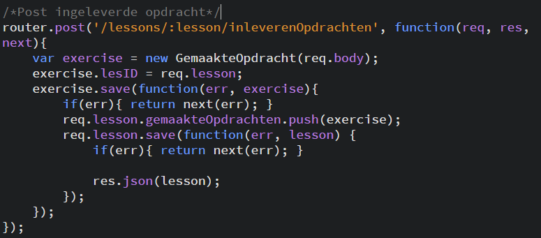

Als NodeJS een POST request krijgt op de URL `/lessons/:lessons/inleverenOpdrachten` (waarvan :lesson een id is die meegegeven wordt in de URL) dan zal deze Mongoose de opdracht geven de data in de database op te slaan en deze data ook te linken via de `exercise.save` function.

###2.2.3. Param
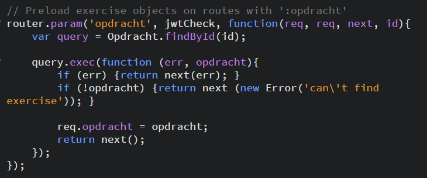

Deze functie zorgt ervoor dat NodeJS de opdracht aan Mongoose geeft om een stukje van de data uit de database te halen voor URL's met :opdracht in, in dit geval. Dit zorgt ervoor dat NodeJS de hele URL en header niet moet gaan analyseren om de zeker nodige data uit de database te halen. Dit zorgt voor een tijdswinst omdat Mongoose al aan het werk gezet kan worden terwijl NodeJS de URL en header verder analyseert.

##2.3. AngularJS

Angular gebruiken we als onze front-end. Dankzij de two-way databinding en de grote beschikbaarheid van verschillende libraries voor Angular zijn de mogelijkheden zeer groot voor onze website. Voor onze `/public/javascripts/angularApp.js` gebruiken we verschillende dingen. Deze worden hieronder allemaal uitgelegd.

###2.3.1. app.config

In de app.config gaan we het gedrag van onze website definiëren op verschillende routes. Deze routes zorgen ervoor dat onze website de juiste inhoud weergeeft.

####2.3.1.1. $stateProvider
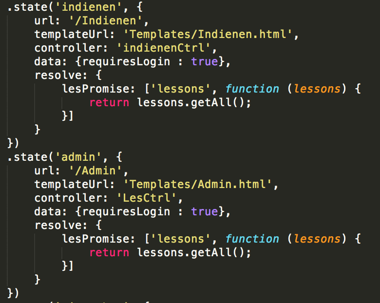

In de $sateProvider gaan we de verschillende states defineren. Deze states zorgen ervoor dat als er naar een bepaalde URL gesurft wordt de juiste state geladen wordt en de pagina juist wordt weergegeven. Via de states kunnen we een controller definiëren die ervoor zorgt dat je een meer dynamische pagina kan maken. Via states kan je ook verschillende verschillende functies definiëren, die functies zorgen ervoor dat er bepaalde dingen uit de database gelande kunnen worden om te gebruiken in de controller of dat als je naar een bepaalde staat gaat er ingelogd moet zijn voor je ernaar toe kan gaan.
####2.3.1.2. $urlRouterProvider
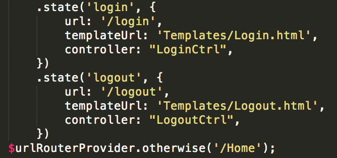

De $urlRouterProvider zorgt ervoor dat als er geen enkele staat voor de URL gevonden kan worden er een bepaalde staat geladen wordt via `$urlRouterProvider.otherwise('/Home')` kan je definiëren dat als er geen overeenkomstige staat wordt gevonden er naar de Home staat verwezen wordt.
####2.3.1.3. authProvider
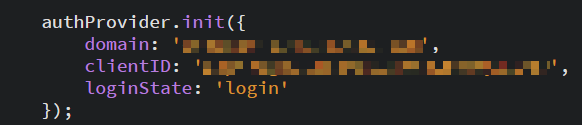
 
Via de authProvider kan je via Angular de authenticatie regelen. Wij gebruiken enkel de `authProvider.init` functie om de authenticatie via [Auth0](#Auth0) te configureren.

####2.3.1.4. jwtInterceptorProvider
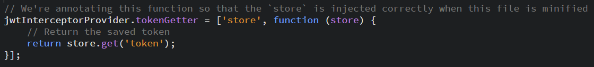

De jwtInterceptorProvider zorgt ervoor dat bij elke request de token wordt meegegeven zodat onze web applicatie deze kan nakijken.

####2.3.1.5. $httpProvider
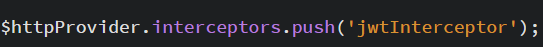

Deze zorgt ervoor dat als je de url in de adresbalkvan je browser verander er wordt gekeken of je wel een token hebt.

###2.3.1. Controllers

Controllers worden gebruikt om data te verkrijgen, verwerken, tonen en door te sturen. Elke pagina die dit nodig heeft krijgt een controller. De controllers zorgen ervoor dat bepaalde code herbruikt kan worden of dat niet elke pagina de data hetzelfde moet verwerken of dezelfde data moet verkrijgen. 

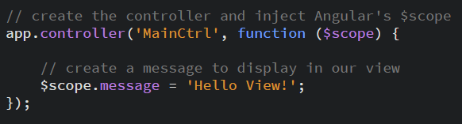

####2.3.2.1. Main controller

Onze Main controller doet eigenlijk niets. Het is gewoon de standaard controller die we hadden meegegeven indien we wilde testen of we meer dynamische inhoud moesten hebben in bepaalde pagina's.

####2.3.2.2. Les controller

De Les controller wordt gebruikt door de admin om nieuwe lessen te maken of om lessen te bekijken die leerlingen al hebben gemaakt.

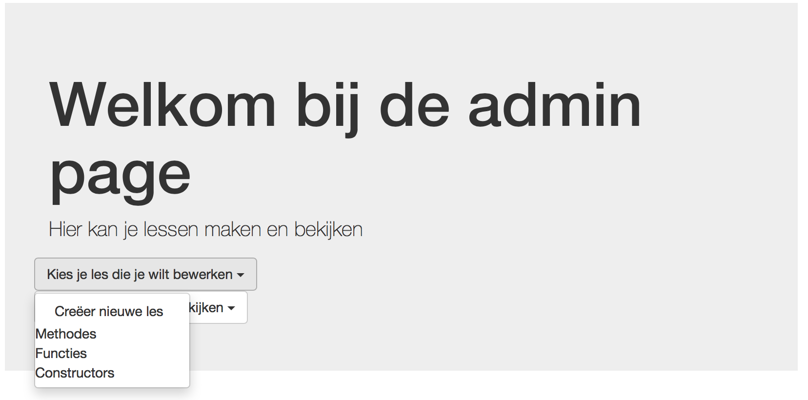

Bij het bewerken kan je nog extra vragen toevoegen aan een les. Het verwijderen van vragen is een functie die nog moet worden toegevoegd.

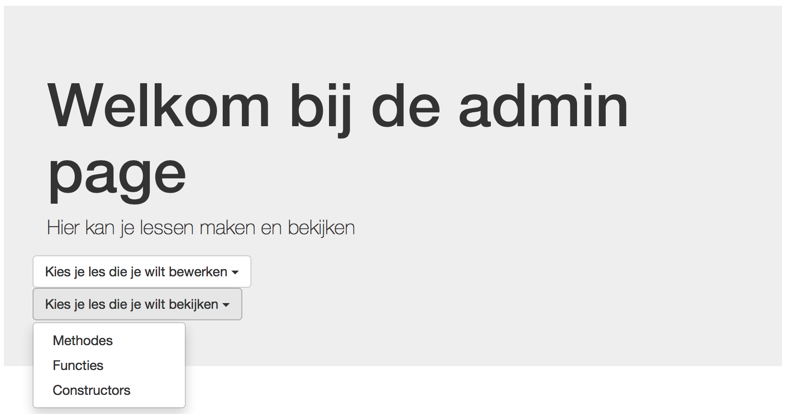

####2.3.2.4. Opdracht controller

De opdracht controller wordt gebruikt om deelopdrachten toe te voegen aan de lessen. Je kan dit in 1 keer doen, of je kan 2 weken na het maken van een les nog eens terugkomen om een opdracht toe te voegen.

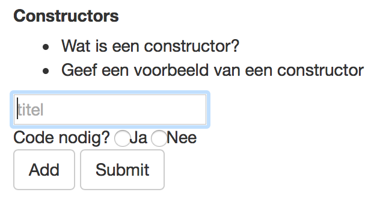

De 'Add' knop kan je gebruiken om een deelopdracht toe te voegen. De 'Submit' knop gebruik je om alle deelopdrachten door te sturen naar de database.

####2.3.2.3. Indienen Controller
Indien je bent ingelogd als leerling, wordt deze controller gebruikt om alle lessen te tonen die de leerkracht heeft gemaakt.

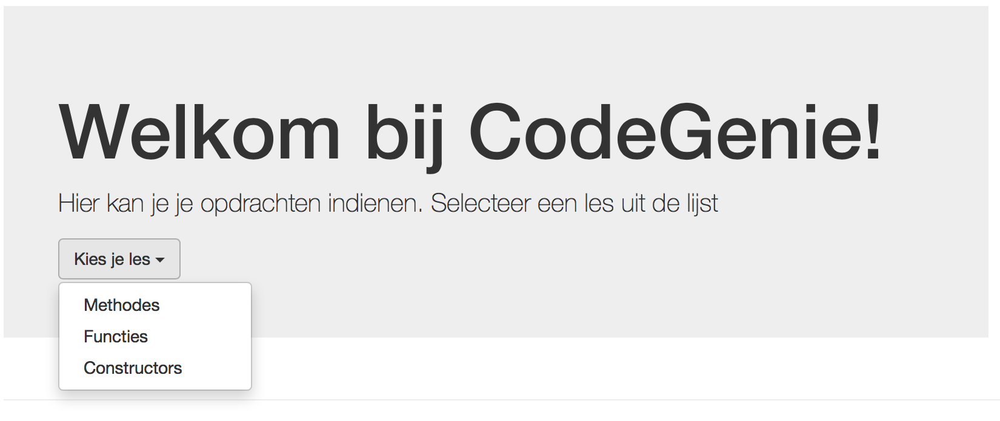

Je kan de les kiezen die je wil indienen, en dan word je doorgestuurd naar de lespagina.

####2.3.2.5. Opdracht indienen Controller

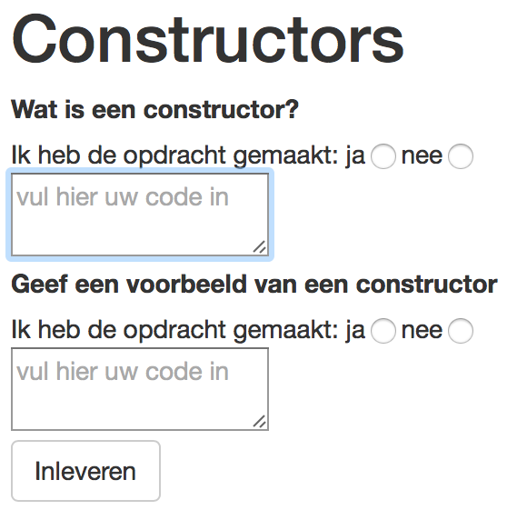

Je kan selecteren of je de vraag al dan niet hebt opgelost, en indien wel, zal je als dit gevraagt wordt de code moeten copy-pasten om mee te uploaden naar de database.

####2.3.2.6. Opdracht ingediend Controller

Deze controller wordt gebruikt door de Admin om gemaakte lessen te kunnen bekijken. Als je de les selecteert kan je daarna zien welke leerlingen deze les gemaakt hebben.

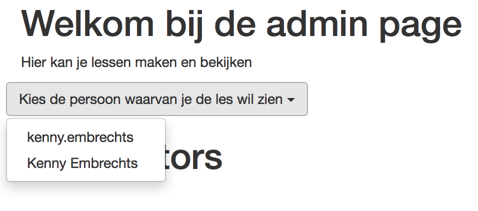

Als je een leerling selecteert kan je zien welke opdrachten van de les deze gemaakt heeft.

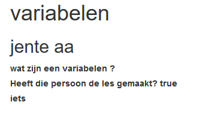

####2.3.2.7. Auth Controller

De controller die je kan gebruiken om in te loggen of uit te loggen. Via ng-show en ng-hide kunnen er de juiste links worden getoond en de knop inloggen of uitloggen.

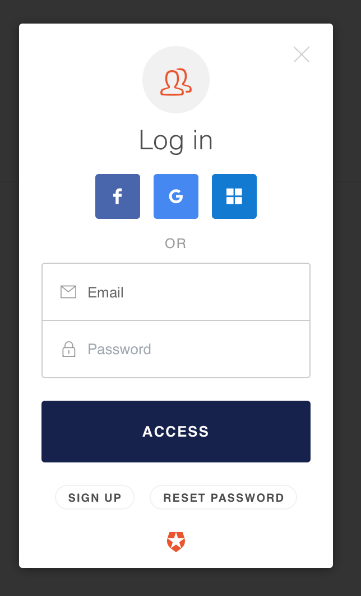

###2.3.3. Factories
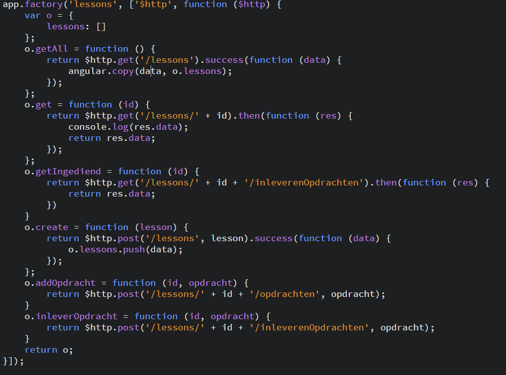

Factories zorgen ervoor dat je gemmakkelijk en zonder dubbele code een request kan doen naar de server. In de factory definieer je een functie daarin definieer je welke request je wil sturen en de URL naar waar je deze wilt versturen en dan definieer je wat er gereturned moet worden. Je roept de factory aan in de controller of in de resolve functie van je routes via voor deze afbeelidng `var lesson = lessons.get(id);`.

###2.3.4. Filters
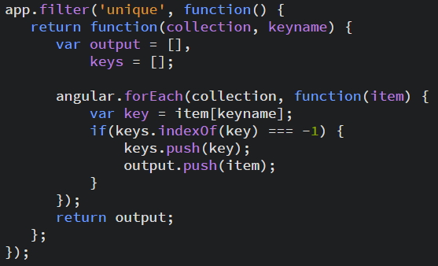

Filters kan je gebruiken om data te transformeren zodat je deze kan gebruiken in je web applicatie. Ik gebruik een filter bij een ng-repeat om dubbele waardes te verwijderen. ng-repeat zorgt ervoor dat je bepaalde data uit een array kan weergeven in eender welke HTML tag vb: 
`
` 
`<label>{{opdracht.opdrachtTitel}}</label>` 
`
` 
Deze geeft alle opdrachtTitels in les.opdrachten

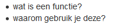

###2.3.5. app.run

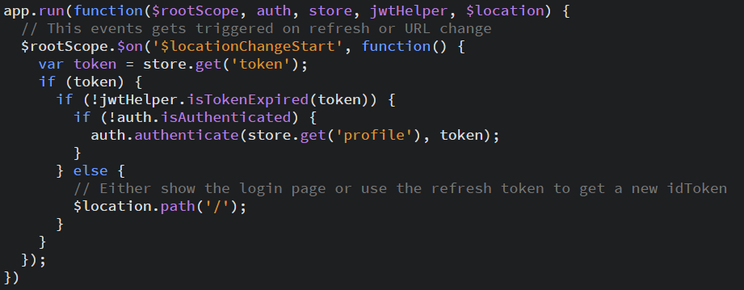

app.run wordt altijd uitgevoerd wanneer er een refresh of een verandering van de URL plaats vind. Wij gebruiken deze voor onze authenticatie.  
1. We gaan kijken of er een token op de computer staat 
2. We gaan kijken of deze token niet verlopen is 
3. We gaan kijken of de persoon niet aangemeld is 
4. De persoon aanmelden 
Als een van de voorwarden niet voldaan is gaan we de persoon terugsturen naar de home pagina.

##2.4. NodeJS

NodeJS is een asynchroon event driven framework dat zeer snel werkt en heel efficient is. NodeJS kan verschillende connecties aan met weinig overhead. NodeJs werkt op JavaScript wat een voordeel is omdat veel mensen JavaScript kennen en de front-end kan werken met javascript waardoor er minder probelemn zijn met het doorgeven van data van de front-end naar de back-end omdat bijde systemen dezelfde taal spreken en dus ook de data op dezelfde manier verwerken. NodeJS levert ook npm mee. Dit is een packetmanager voor NodeJs waardoor het makkelijker wordt gemaakt om extra modules te instaleren.

##2.5. Auth0

Auth0 is een startup dat zich inzet om het ontwikkelen van authenticatie systemen zeer gemakkelijk te maken en met zeer veel functionaliteiten. eigenlijk is het zo gemakkelijk dat je moet kiezen waarmee je je wilt kunnen inloggen een developer account aanmaken op deze systemen wat eignelijk een tutorial volgen is op de Auth0 website en daarna de quickstart guide volgen en alles copy-pasten.

###2.5.1. Auth0 in CodeGenie

In de webiste van CodeGenie hebben we ervoor gekozen om aanmelden mogelijk te maken via Facebook, Google, Microsoft en een eigen aangemaakt account. Je kan je ook aanmelden via een Office365 account of via de Active Directory wat wel handig kan zijn voor op school zonder dat daar veel moeite in gestoken moet worden. enkel een paar parameters ingeven en het werkt. Een groot voordeel aan Auth0 is dat je ook een aantal velden krijgt om paramters in te steken op gebruikers niveau. We hebben ervoor gekozen om bij de administrators van CodeGenie in het veld user_metadata `isAdmin:true` te zetten waardoor onze app kan zien wie er Admin is en wie niet en zo de juiste informatie laten zien.

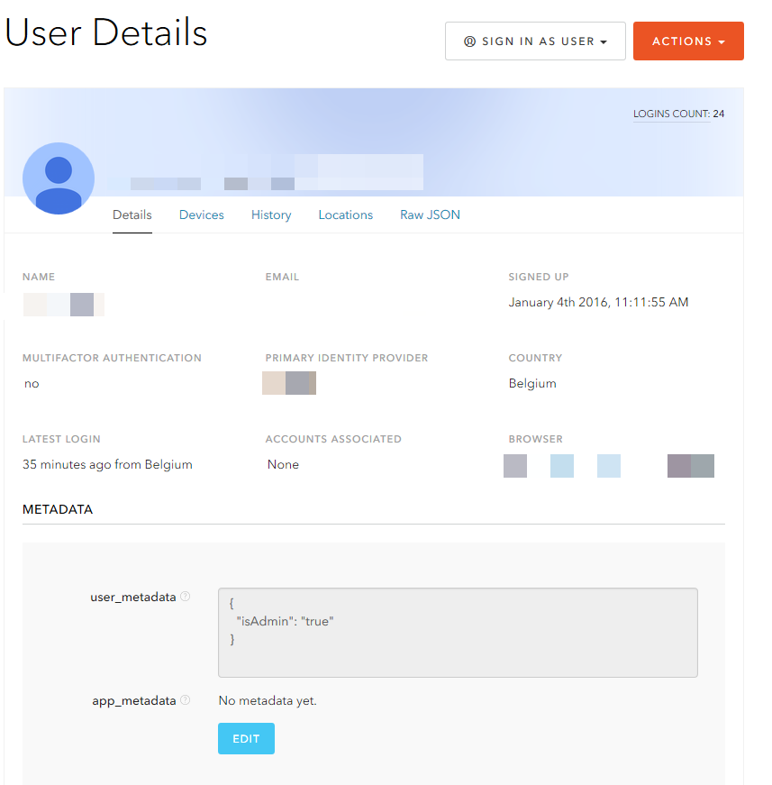

#3. CodeGenie deployen

Je hebt NodeJS nodig de versie maakt niet uit. liefst >5.0.
manier van deployen: 
1. ga naar `CodeGenie/CodeGenie/` via de terminal 
2. type `npm install` in de terminal 
3. type `npm start` in de terminal 
4. surf naar ``localhost:3001` 

#4. Conclusie
We hebben veel bijgeleerd over de MEAN stack over JavaScript en over debuggen. Het project was in het begin zeker niet gemakkelijk en we hebben er lang overgedaan om alles goed te snappen en op weg te geraken. We zaten soms met onze handen in de haren en half de klas kwam meehelpen en uiteindelijk bleek dit een probleem met een `console.log();` te zijn :sweat:. Maar we hebben dit project tot een goed einde gebracht met de nodige functies. We hadden spijtig genoeg wel te weinig tijd om ook een aantal nice to have's er in te zetten. Maar we zijn toch blij met het uiteindelijke resultaat. 