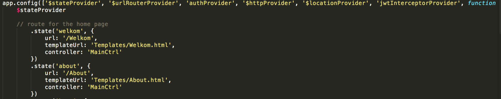

# Cloud Applications
## CodeGenie

Kenny Embrechts & Jente Adams

3EA1

##Voorwoord
We hebben dit project gekregen van Tim Dams. Het is een persoonlijk project voor hem dat hij graag zou gebruiken voor het quoteren van zijn studenten. Het project was leuk, met af en toe wat obstakels, maar we hebben het toch toch een redelijk goed einde gebracht.

# Inhoudsopgave

[1. Inleiding](#Inleiding) 
[2. Specificaties](#Specificaties) 
>[2.1. Mongo DB](#Mongo-DB) 
>[2.2. Express JS](#Express-JS) 
>>[2.2. HTTP service](#HTTP-Service) 
>>[2.2. Request handler](#Request-handler) 

>[2.3. Angular JS](#Angular-JS) 
>>[2.3.1 States](#States) 
>>[2.3.2 Controllers](#Controllers) 
>>>[2.3.2.1 Main controller](#MainCtrl) 
>>>[2.3.2.2 Les controller](#LesCtrl) 
>>>[2.3.2.3 Opdracht controller](#OpdrachtCtrl) 
>>>[2.3.2.4 Indienen controller](#IndienenCtrl) 
>>>[2.3.2.5 Opdracht indienen controller](#OpdrachtIndienenCtrl) 
>>>[2.3.2.6 Opdracht ingedient controller](#OpdrachtIngedientCtrl) 
>>>[2.3.2.7 Login controller](#LoginCtrl) 
>>>[2.3.2.8 Logout controller](#LogoutCtrl) 

>[2.3. Node JS](#Node-JS) 
>[2.3. Auth0](#Auth0) 

[4. Conclusie](#Conclusie)

#1. Inleiding

CodeGenie is een project dat we hebben gemaakt voor meneer Dams. De bedoeling is dat de meneer Dams (als admin) lessen kan maken en bekijken. De lessen worden gemaakt en er worden deelopdrachten aan toegevoegd. meneer Dams kan selecteren of er al dan niet code moet worden toegevoegd. Hij kan ook zien welke leerlingen de lessen hebben gemaakt, en welke deelopdrachten van de eerder gezegde les. Dit is allemaal gedaan om het quoteren te vergemakkelijken. Het is makkelijk te zien welke leerlingen gehele lessen niet hebben gemaakt, en daar kan je dus makkelijk een 0 voor geven. Ook bij de deelopdrachten staat dit goed aangegeven.

Als leerling kan je dus de lessen maken. Je kan selecteren of je de les hebt gemaakt, en daarna of je de deelopdrachten hebt gemaakt. Je kan aan de hand van de daarvoor voorziene textboxen de code toevoegen die je hebt geschreven.

#2. Specificaties

Hier gaan we het hebben over de [MEAN-stack](https://en.wikipedia.org/wiki/MEAN_(software_bundle)) die we hebben gebruikt om het project te bouwen. We gaan de component uitleggen, en dan toelichten hoe wij dit hebben gebruikt in ons project
##2.1. Mongo DB

Mongo DB wordt gebruikt voor het maken van databases. Het is niet de conventionele vorm die we altijd al kenden met tabellen. Het gebruikt documenten om de tabellen te beschrijven, met de veldnamen e.d.
##2.2. Express JS

Dit is een framework dat wordt gebruikt door [Node JS](#Node-JS). Je kan dit gebruiken voor single page, multi page en hybride web-applicaties. Het is dus de backend van ons project.

###2.2.1 HTTP service

Dit maakt het mogelijk om een web service te starten. 

Moest je nu surfen naar localhost:1337, zou je 'Hello world!" krijgen op het scherm. Dit is dus een enorm simpele manier om een webpagina up and running te krijgen.
###2.2.1 Request handler

Als je een request doet naar de server, zal de request handler deze request handlen. 

Je gaat een GET request doen naar de server. De handler gaat de data doorsturen naar de server

De response (in het stukje 'response') geeft je volledige, en bruikbare responses.
##2.3. Angular JS

Voor onze angular.app.js gebruiken we verschillende dingen. Deze worden allemaal uitgelegd.

###2.3.1 States

In de app.config gaan we verschillende states definiëren. Deze states worden gebruikt voor het klikken op een url op onze pagina. Per pagina die je wil kunnen bezoeken. Indien je een url wil bezoeken die niet bestaat, zal je via de otherwise state, naar de home pagina worden doorverwezen.

###2.3.1 Controllers

Controllers worden gebruikt om data te verkrijgen, verwerken, tonen en door te sturen. Elke pagina die dit nodig heeft krijgt een aparte controller.

####2.3.2.1 Main controller

Onze Main controller doet eigenlijk niets. Het is gewoon de standaard controller die we hadden meegegeven indien we iets nodig hadden op onze top-level pages.

####2.3.2.2 Les controller

De Les controller wordt gebruikt door de admin op nieuwe lessen te maken of om lessen te bekijken die leerlingen al hebben gemaakt.

####2.3.2.4 Opdracht controller
####2.3.2.3 Indienen Controller
Indien je bent ingelogd als leerling, wordt deze controller gebruikt om alle lessen te tonen die de leerkracht heeft gemaakt.

Je kan de les kiezen die je wil indienen, en dan word je doorgestuurd naar de lespagina.

Je kan selecteren of je de vraag al dan niet hebt opgelost, en indien wel, zal je de code moeten copy-pasten om mee te uploaden naar de database.

####2.3.2.5 Opdracht indienen Controller
####2.3.2.6 Opdracht ingedient Controller
####2.3.2.7 Login Controller
####2.3.2.8 Logout Controller
##2.4. Node JS
##2.4. Auth0

